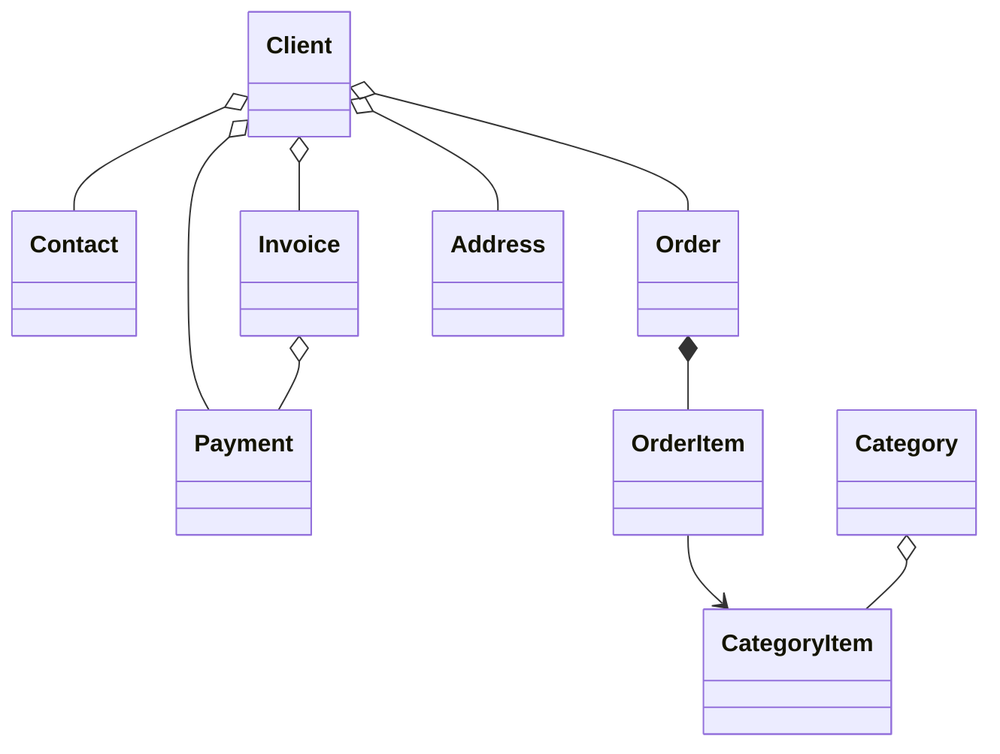

#  B2B CRM

🖥️ [Online Demo](https://demo.jmix.io/b2b-crm/login)

🌐 Sprachen: [English](../README.md) | [Русский](README_ru.md) | [Deutsch](README_de.md) | [Italiano](README_it.md) | [Español](README_es.md) | [Tiếng Việt](README_vi.md) | [Srpski](README_sr.md)

`B2B CRM` ist eine Enterprise-Demoanwendung auf Basis des `Jmix Frameworks` mit integrierter `AI`, die zeigt, wie produktionsreife Geschäftssysteme für `Kunden`, `Aufträge`, `Rechnungsstellung`, `Finanzen` und `Analysen` entwickelt werden.

## 📑 Inhaltsverzeichnis

- [Technischer Stack](#-technischer-stack)
- [Überblick](#-überblick)
- [AI-Assistent](#-ai-assistent)
- [Add-ons](#-verwendete-add-ons)
- [Build & Start](#-build-und-start)
- [Demo-Daten](#-demo-daten)
- [Konten](#-anwendungskonten)
- [Domänenmodell](#-domänenmodell)
- [Rollenmodell](#-rollenmodell)
- [Mehr über Jmix](#ℹ-mehr-über-jmix)
- [FAQ](#-faq)

## 🛠️ Technischer Stack

- Java 21
- Jmix (Spring Boot & Vaadin Flow)
- Firebird

## 📖 Überblick

<details>
<summary>📸 Screenshots (zum Aufklappen klicken)</summary>

<h3>Anmeldeseite</h3>


<h3>Dashboard</h3>


<h3>CRM AI</h3>


<h3>Kunden</h3>


<h3>Aufträge</h3>


<h3>Über die Anwendung</h3>


</details>

### ✨ Hauptfunktionen

Dieses Projekt modelliert einen typischen B2B-Vertriebsablauf:

- Produkt- und Kategorienkatalog verwalten
- Kunden, Kontakte und Adressen pflegen
- Aufträge über den Vertriebstrichter nachverfolgen
- Rechnungen ausstellen und Zahlungen erfassen
- Benutzeraufgaben planen und überwachen
- Den integrierten AI-Assistenten nach geschäftlichen Erkenntnissen fragen
- Vertriebsanalysen im Dashboard und in integrierten Berichten ansehen

#### 📈 Vertriebsautomatisierung

`B2B CRM` hilft Vertriebsmanagern, den Vertriebsprozess zu automatisieren: Das System verfolgt Deals, Rechnungen,
Zahlungen und Benutzeraufgaben und liefert schnelle Analysen zu Kunden. Zum Beispiel kann es typische Fragen schnell
beantworten, etwa:

- Wie viele Deals befinden sich in der Presale-Phase oder warten auf Zahlung, und über welchen Gesamtbetrag
- Welche Kunden sind die Umsatzführer und welche die Nachzügler — und in welchen Produktkategorien
- Wie häufig kaufen die ausgewählten Kunden
- Wie sich die Angebote für einen Kunden untereinander vergleichen und wie hoch die maximalen Rabatte für eine bestimmte Produktkategorie waren

Normalerweise erfordern solche Anfragen die Konfiguration spezialisierter Berichte und das Wissen eines Analysten. In
`B2B CRM` genügt es, die Anfrage in natürlicher Sprache zu formulieren: Der integrierte [AI-Assistent](#-ai-assistent)
hilft dabei, den Vertrieb zu analysieren, indem er Daten zu Deals, Rechnungen und Zahlungen aggregiert — unter
Berücksichtigung der Datenzugriffsrechte des Benutzers.

#### 🔽 Vertriebstrichter

Der Bildschirm `Aufträge` enthält einen interaktiven Vertriebstrichter auf Basis der Auftragsstatus:
`Neu` → `Angenommen` → `In Bearbeitung` → `Erledigt`.
Jede Stufe zeigt die Anzahl der Aufträge auf ihr, und ein einzelner Klick führt den Manager zu den Aufträgen der
ausgewählten Stufe — mit den Beträgen für Gesamtsumme, Berechnet, Bezahlt und Restbetrag je Auftrag.

## 🤖 AI-Assistent

Die Anwendung enthält einen integrierten `CRM AI`-Arbeitsbereich für die natürlichsprachliche Analyse von CRM-Daten.

#### ✨ Wichtige Funktionen:

- Geschäftsfragen zu Kunden, Aufträgen, Rechnungen, Zahlungen und Vertriebsleistung stellen
- Entitäten und Dateien in den Konversationskontext hochladen
- Die Datenzugriffsrechte des aktuellen Benutzers berücksichtigen und Konversationen nur für ihren Autor sichtbar halten
- Integrierte Geschäftsberichte wie `Client 360 Report` und `Category Cashflow Risk Allocation Report` verwenden
- Den Konversationsverlauf mit automatisch generierten Chat-Titeln speichern
- Interaktive Links zu CRM-Datensätzen direkt in Antworten generieren

#### ⚙️ Konfiguration:

Setze `spring.ai.openai.api-key` in [application.properties](../src/main/resources/application.properties)
oder stelle die Umgebungsvariable `SPRING_AI_OPENAI_APIKEY` bereit.

Nach der Aktivierung öffne den Menüpunkt `CRM AI` im Hauptmenü, um eine neue Konversation zu starten.

## 🧩 Verwendete Add-ons

- [AI Tools](https://www.jmix.io/marketplace/ai-tools/)
- [Audit](https://www.jmix.io/marketplace/audit/)
- [Application Settings](https://www.jmix.io/marketplace/application-settings/)
- [Charts](https://www.jmix.io/marketplace/charts/)
- [Data tools](https://www.jmix.io/marketplace/data-tools/)
- [Dynamic attributes](https://www.jmix.io/marketplace/dynamic-attributes/)
- [Grid export](https://www.jmix.io/marketplace/grid-export-actions/)
- [Reports](https://www.jmix.io/marketplace/reports/)
- Local File Storage, Localizations

## 🚀 Build und Start

#### Projekt starten

1. Starte die Jmix-Run-Konfiguration [B2B CRM](../.run/crm-app.run.xml) oder führe aus

   ```bash
   ./gradlew bootRun
   ```

2. [Anwendungs-URL öffnen](http://localhost:8080/b2b-crm)

#### Start per JAR:

```bash
./gradlew bootJar -Pvaadin.productionMode
```

```bash
java -jar build/libs/crm.jar
```

#### Start per Docker

```bash
docker build -t jmix-crm .
```

```bash
docker run --rm -p 8080:8080 jmix-crm
```

#### Start per Docker Compose

```bash
docker-compose up
```

## 🎲 Demo-Daten

Das lokale Profil generiert Demo-Daten beim Start der Anwendung:

- Die Generierung von Demo-Daten kann mit der Eigenschaft `crm.generateDemoData`
  in [application.properties](../src/main/resources/application.properties) deaktiviert werden
- Der Katalog wird aus [catalog.xlsx](../src/main/resources/demo-data/catalog.xlsx) importiert

## 👥 Anwendungskonten

| Position        | Benutzername | Passwort | Zugriff                                             |
|-----------------|--------------|----------|-----------------------------------------------------|
| Administrator   | `admin`      | admin    | Vollzugriff auf alle Daten und Einstellungen        |
| Supervisor      | `james`      | james    | Manager + Katalogverwaltung + Konten zuweisen       |
| Manager         | `manager`    | manager  | Vollzugriff auf alle Kunden und Aufträge            |
| Account Manager | `alice`      | alice    | Sieht nur Kunden, die Alice Brown zugewiesen sind   |
| Account Manager | `robert`     | robert   | Sieht nur Kunden, die Robert Taylor zugewiesen sind |

## ⚙️ Domänenmodell



## 🔐 Rollenmodell

Die Anwendung verwendet ein hierarchisches Rollenmodell:

| Rolle           | Beschreibung                                                                                                                                                       |
|-----------------|--------------------------------------------------------------------------------------------------------------------------------------------------------------------|
| `Administrator` | Vollzugriff auf alle Anwendungsfunktionen, Entitäten und Einstellungen.                                                                                            |
| `Supervisor`    | Erweitert die Rolle `Manager` um zusätzliche administrative Funktionen: Produktkatalog verwalten und Account Managers Kunden zuweisen.                             |
| `Manager`       | Primäre Rolle für Vertriebsprozesse. Vollzugriff auf Clients, Contacts, Orders, Invoices und Payments. Lesezugriff auf den Produktkatalog. Eigene Tasks verwalten. |
| `UI Minimal`    | Minimaler Zugriff, der Anmeldung und grundlegende Navigation ermöglicht.                                                                                           |

## ℹ️ Mehr über Jmix

| Quelle           | Link                                            |
|------------------|-------------------------------------------------|
| 🌐 Website       | https://www.jmix.io                             |
| 📚 Dokumentation | https://docs.jmix.io                            |
| 💬 Forum         | https://forum.jmix.io                           |
| 💻 GitHub        | https://github.com/jmix-framework/jmix          |
| 🎥 YouTube       | https://www.youtube.com/@jmixframework          |
| 💼 LinkedIn      | https://www.linkedin.com/company/jmix-framework |

## 💬 FAQ

> Was ist Jmix?

Jmix ist eine Full-Stack-Open-Source-Java-Plattform für die Entwicklung von Unternehmenssoftware mit lokalen und öffentlichen Modellen.
Sie hilft Entwicklungsteams, interne Geschäftsanwendungen schneller zu erstellen und dabei die vollständige Kontrolle über Quellcode, Architektur und Deployment zu behalten. Jmix vereint Java, Spring Boot, Enterprise-UI, Sicherheit, Datenzugriff, visuelle Entwicklungswerkzeuge und AI-gestützte Entwicklung in einer einzigen Plattform.

**Mehr erfahren:**

| Quelle        | Link                                   |
|---------------|----------------------------------------|
| Website       | https://www.jmix.io/                   |
| Dokumentation | https://docs.jmix.io/                  |
| GitHub        | https://github.com/jmix-framework/jmix |

---

> Warum ist Jmix gut für den Aufbau von CRM-Systemen geeignet?

CRM-Systeme sind zum Rückgrat der modernen Unternehmensautomatisierung geworden und gehen weit über ein einfaches Aufzeichnungssystem hinaus. Da sich Geschäftsanforderungen im Vertrieb schnell ändern, müssen CRM-Systeme auch die Möglichkeit bieten, Workflows, Datenmodell und UX schnell anzupassen und dabei hohe Sicherheits- und Compliance-Standards einzuhalten.
Jmix bietet diese Fähigkeiten von Anfang an, sodass sich Entwickler auf die Geschäftslogik statt auf die Infrastruktur konzentrieren können. Diese Demo zeigt, wie produktionsreife Unternehmensanwendungen mit Jmix und AI entwickelt werden können.

---

> Ist das eine echte Anwendung oder nur eine Demo?

B2B CRM ist eine Demoanwendung, die produktionsreife Architektur und Praktiken der Unternehmensentwicklung demonstrieren soll.
Sie enthält reale Geschäftsszenarien, eine moderne UI, AI-Funktionen, Sicherheit, Reporting und Integrationsmuster, die in eigenen Unternehmensprojekten wiederverwendet werden können.
