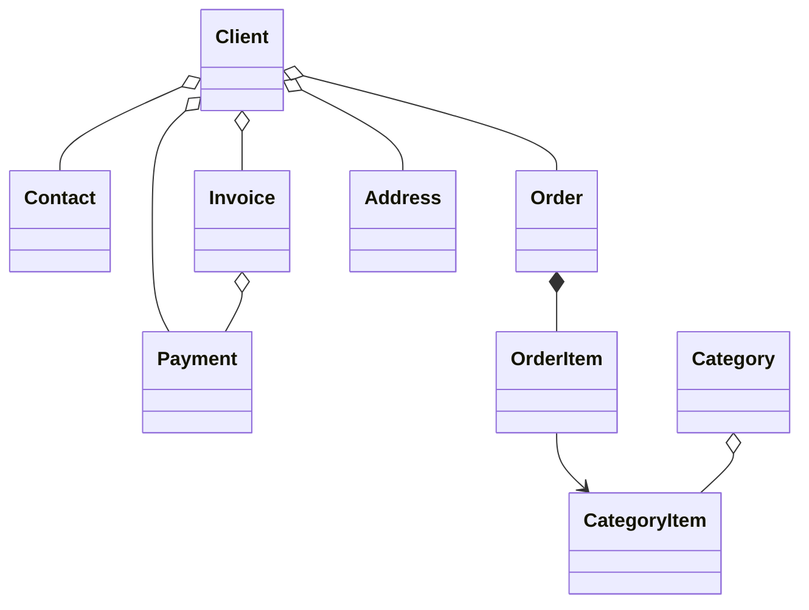

#  B2B CRM

🖥️ [Online Demo](https://demo.jmix.io/b2b-crm/login)

🌐 Idiomas: [English](../README.md) | [Русский](README_ru.md) | [Deutsch](README_de.md) | [Italiano](README_it.md) | [Español](README_es.md) | [Tiếng Việt](README_vi.md) | [Srpski](README_sr.md)

`B2B CRM` es una aplicación demo empresarial basada en el `framework Jmix` con `AI` integrada que muestra cómo desarrollar sistemas de negocio listos para producción con `clientes`, `pedidos`, `facturación`, `finanzas` y `analítica`.

## 📑 Índice

- [Stack tecnológico](#-stack-tecnológico)
- [Resumen](#-resumen)
- [Asistente de IA](#-asistente-de-ia)
- [Add-ons](#-add-ons-utilizados)
- [Build y ejecución](#-build-y-ejecución)
- [Datos demo](#-datos-demo)
- [Cuentas](#-cuentas-de-la-aplicación)
- [Modelo de dominio](#-modelo-de-dominio)
- [Modelo de roles](#-modelo-de-roles)
- [Más sobre Jmix](#ℹ-más-sobre-jmix)
- [FAQ](#-faq)

## 🛠️ Stack tecnológico

- Java 21
- Jmix (Spring Boot & Vaadin Flow)
- Firebird

## 📖 Resumen

<details>
<summary>📸 Capturas de pantalla (haz clic para expandir)</summary>

<h3>Página de inicio de sesión</h3>


<h3>Panel de control</h3>


<h3>CRM AI</h3>


<h3>Clientes</h3>


<h3>Pedidos</h3>


<h3>Acerca de</h3>


</details>

### ✨ Características principales

Este proyecto modela un flujo típico de ventas B2B:

- Gestionar el catálogo de productos y categorías
- Mantener clientes, contactos y direcciones
- Hacer seguimiento de los pedidos a través del embudo de ventas
- Emitir facturas y registrar pagos
- Planificar y controlar las tareas de usuario
- Preguntar al asistente de IA integrado por perspectivas de negocio
- Ver la analítica de ventas en el panel de control y en los informes integrados

#### 📈 Automatización de ventas

`B2B CRM` ayuda a los responsables de ventas a automatizar el proceso de ventas: el sistema lleva el control de las oportunidades, las facturas, los pagos y las tareas de usuario, y ofrece analítica rápida sobre los clientes. Por ejemplo, puede responder rápidamente a preguntas habituales como:

- Cuántas oportunidades están en la fase de preventa o esperando el pago, y por qué importe total
- Qué clientes son los líderes en ingresos y cuáles los rezagados — y en qué categorías de producto
- Con qué frecuencia compran los clientes seleccionados
- Cómo se comparan entre sí las propuestas para un cliente y cuáles fueron los descuentos máximos en una categoría de producto concreta

Normalmente, estas consultas requieren configurar informes especializados y conocimientos de analista. En `B2B CRM` basta con escribir la consulta en lenguaje natural: el [Asistente de IA](#-asistente-de-ia) integrado ayuda a analizar las ventas agregando datos de oportunidades, facturas y pagos, respetando los permisos de acceso a datos del usuario.

#### 🔽 Embudo de ventas

La pantalla `Pedidos` incluye un embudo de ventas interactivo basado en los estados de los pedidos: `Nuevo` → `Aceptado` → `En curso` → `Completado`. Cada etapa muestra el número de pedidos que hay en ella, y con un solo clic el manager accede a los pedidos de la etapa seleccionada — con los importes total, facturado, pagado y pendiente de cada pedido.

## 🤖 Asistente de IA

La aplicación incluye un espacio de trabajo integrado `CRM AI` para el análisis de datos CRM en lenguaje natural.

#### ✨ Capacidades clave:

- Hacer preguntas de negocio sobre clientes, pedidos, facturas, pagos y rendimiento de ventas
- Subir entidades y archivos al contexto de la conversación
- Respetar los permisos de acceso a datos del usuario actual y mantener las conversaciones privadas para su autor
- Usar informes de negocio integrados como `Client 360 Report` y `Category Cashflow Risk Allocation Report`
- Mantener el historial de conversación con títulos de chat generados automáticamente
- Generar enlaces interactivos a registros CRM directamente en las respuestas

#### ⚙️ Configuración:

Define `spring.ai.openai.api-key` en [application.properties](../src/main/resources/application.properties)
o proporciona la variable de entorno `SPRING_AI_OPENAI_APIKEY`.

Cuando esté habilitado, abre el elemento `CRM AI` en el menú principal para iniciar una nueva conversación.

## 🧩 Add-ons utilizados

- [AI Tools](https://www.jmix.io/marketplace/ai-tools/)
- [Audit](https://www.jmix.io/marketplace/audit/)
- [Application Settings](https://www.jmix.io/marketplace/application-settings/)
- [Charts](https://www.jmix.io/marketplace/charts/)
- [Data tools](https://www.jmix.io/marketplace/data-tools/)
- [Dynamic attributes](https://www.jmix.io/marketplace/dynamic-attributes/)
- [Grid export](https://www.jmix.io/marketplace/grid-export-actions/)
- [Reports](https://www.jmix.io/marketplace/reports/)
- Local File Storage, Localizations

## 🚀 Build y ejecución

#### Ejecutar el proyecto

1. Ejecuta la configuración Jmix [B2B CRM](../.run/crm-app.run.xml) o ejecuta

   ```bash
   ./gradlew bootRun
   ```

2. [Abre la URL de la aplicación](http://localhost:8080/b2b-crm)

#### Ejecutar mediante JAR:

```bash
./gradlew bootJar -Pvaadin.productionMode
```

```bash
java -jar build/libs/crm.jar
```

#### Ejecutar mediante Docker

```bash
docker build -t jmix-crm .
```

```bash
docker run --rm -p 8080:8080 jmix-crm
```

#### Ejecutar mediante Docker Compose

```bash
docker-compose up
```

## 🎲 Datos demo

El perfil local genera datos demo al iniciar la aplicación:

- Puedes desactivar la generación de datos demo con la propiedad `crm.generateDemoData`
  en [application.properties](../src/main/resources/application.properties)
- El catálogo se importa desde [catalog.xlsx](../src/main/resources/demo-data/catalog.xlsx)

## 👥 Cuentas de la aplicación

| Puesto          | Usuario   | Contraseña | Acceso                                                |
|-----------------|-----------|------------|-------------------------------------------------------|
| Administrator   | `admin`   | admin      | Acceso completo a todos los datos y configuraciones   |
| Supervisor      | `james`   | james      | Manager + gestión de catálogo + asignación de cuentas |
| Manager         | `manager` | manager    | Acceso completo a todos los clientes y pedidos        |
| Account Manager | `alice`   | alice      | Solo ve clientes asignados a Alice Brown              |
| Account Manager | `robert`  | robert     | Solo ve clientes asignados a Robert Taylor            |

## ⚙️ Modelo de dominio



## 🔐 Modelo de roles

La aplicación usa un modelo jerárquico de roles:

| Rol             | Descripción                                                                                                                                                                                    |
|-----------------|------------------------------------------------------------------------------------------------------------------------------------------------------------------------------------------------|
| `Administrator` | Acceso completo a todas las funciones, entidades y configuraciones de la aplicación.                                                                                                           |
| `Supervisor`    | Extiende el rol `Manager` con capacidades administrativas adicionales: gestionar el catálogo de productos y asignar Account Managers a los clientes.                                           |
| `Manager`       | Rol principal para las operaciones de ventas. Acceso completo a Clients, Contacts, Orders, Invoices y Payments. Acceso de solo lectura al catálogo de productos. Gestión de sus propias Tasks. |
| `UI Minimal`    | Acceso mínimo que permite iniciar sesión y navegación básica.                                                                                                                                  |

## ℹ️ Más sobre Jmix

| Fuente          | Enlace                                          |
|-----------------|-------------------------------------------------|
| 🌐 Sitio web    | https://www.jmix.io                             |
| 📚 Documentación | https://docs.jmix.io                            |
| 💬 Foro         | https://forum.jmix.io                           |
| 💻 GitHub       | https://github.com/jmix-framework/jmix          |
| 🎥 YouTube      | https://www.youtube.com/@jmixframework          |
| 💼 LinkedIn     | https://www.linkedin.com/company/jmix-framework |

## 💬 FAQ

> ¿Qué es Jmix?

Jmix es una plataforma Java full-stack de código abierto para el desarrollo de software empresarial con modelos locales y públicos.
Ayuda a los equipos de desarrollo a crear aplicaciones de negocio internas más rápido manteniendo el control total sobre el código fuente, la arquitectura y el despliegue. Jmix combina Java, Spring Boot, UI empresarial, seguridad, acceso a datos, herramientas de desarrollo visual y desarrollo asistido por IA en una única plataforma.

**Más información:**

| Fuente | Enlace                                 |
|--------|----------------------------------------|
| Sitio  | https://www.jmix.io/                   |
| Docs   | https://docs.jmix.io/                  |
| GitHub | https://github.com/jmix-framework/jmix |

---

> ¿Por qué Jmix es bueno para construir sistemas CRM?

Los sistemas CRM se han convertido en la columna vertebral de la automatización empresarial moderna, mucho más allá de un simple sistema de registros. Como los requisitos de negocio en ventas cambian rápidamente, los sistemas CRM también deben ofrecer la capacidad de implementar cambios rápidos en los flujos de trabajo, el modelo de datos y la UX, preservando altos estándares de seguridad y cumplimiento.
Jmix ofrece estas capacidades de fábrica, permitiendo a los desarrolladores centrarse en la lógica de negocio en lugar de la infraestructura. Esta demo muestra cómo se pueden desarrollar aplicaciones empresariales listas para producción usando Jmix e IA.

---

> ¿Es una aplicación real o solo una demo?

B2B CRM es una aplicación demo diseñada para demostrar una arquitectura lista para producción y prácticas de desarrollo empresarial.
Incluye escenarios de negocio reales, UI moderna, capacidades de IA, seguridad, informes y patrones de integración que puedes reutilizar en tus propios proyectos empresariales.
