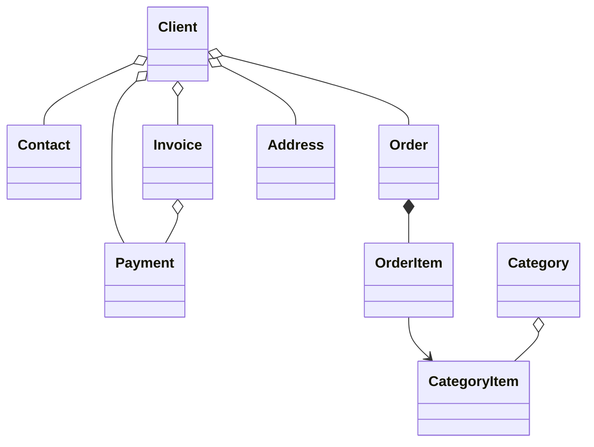

#  B2B CRM

🖥️ [Online Demo](https://demo.jmix.io/b2b-crm/login)

🌐 Lingue: [English](../README.md) | [Русский](README_ru.md) | [Deutsch](README_de.md) | [Italiano](README_it.md) | [Español](README_es.md) | [Tiếng Việt](README_vi.md) | [Srpski](README_sr.md)

`B2B CRM` è un'applicazione demo aziendale basata sul `framework Jmix` con `AI` integrata, che mostra come sviluppare sistemi di business pronti per la produzione per `clienti`, `ordini`, `fatture`, `finanza` e `analitica`.

## 📑 Indice

- [Stack tecnico](#-stack-tecnico)
- [Panoramica](#-panoramica)
- [Assistente AI](#-assistente-ai)
- [Add-on](#-add-on-utilizzati)
- [Build ed esecuzione](#-build-ed-esecuzione)
- [Dati demo](#-dati-demo)
- [Account](#-account-dellapplicazione)
- [Modello di dominio](#-modello-di-dominio)
- [Modello dei ruoli](#-modello-dei-ruoli)
- [Maggiori informazioni su Jmix](#ℹ-maggiori-informazioni-su-jmix)
- [FAQ](#-faq)

## 🛠️ Stack tecnico

- Java 21
- Jmix (Spring Boot & Vaadin Flow)
- Firebird

## 📖 Panoramica

<details>
<summary>📸 Screenshot (clicca per espandere)</summary>

<h3>Pagina di accesso</h3>


<h3>Dashboard</h3>


<h3>CRM AI</h3>


<h3>Clienti</h3>


<h3>Ordini</h3>


<h3>Informazioni</h3>


</details>

### ✨ Caratteristiche principali

Questo progetto modella un tipico flusso di vendita B2B:

- Gestione del catalogo prodotti e categorie
- Gestione di clienti, contatti e indirizzi
- Tracciamento degli ordini attraverso il funnel di vendita
- Emissione di fatture e registrazione dei pagamenti
- Pianificazione e monitoraggio dei compiti degli utenti
- Richiesta di business-insight all'assistente AI integrato
- Visualizzazione delle analisi di vendita sulla dashboard e nei report integrati

#### 📈 Automazione delle vendite

`B2B CRM` aiuta i responsabili delle vendite ad automatizzare il processo di vendita: il sistema tiene traccia di
trattative, fatture, pagamenti e compiti degli utenti e fornisce analisi rapide sui clienti. Ad esempio, può rispondere
rapidamente a domande tipiche come:

- Quante trattative si trovano in fase di prevendita o in attesa di pagamento, e per quale importo totale
- Quali clienti sono i leader per fatturato e quali gli outsider — e in quali categorie di prodotto
- Con quale frequenza i clienti selezionati effettuano acquisti
- Come si confrontano tra loro le proposte per un cliente e quali sono stati gli sconti massimi per una determinata categoria di prodotto

Normalmente, richieste di questo tipo richiedono la configurazione di report specializzati e competenze da analista.
In `B2B CRM` è sufficiente scrivere la richiesta in linguaggio naturale: l'[Assistente AI](#-assistente-ai) integrato
aiuta ad analizzare le vendite aggregando i dati su trattative, fatture e pagamenti, rispettando al contempo le
autorizzazioni di accesso ai dati dell'utente.

#### 🔽 Funnel di vendita

La schermata `Ordini` include un funnel di vendita interattivo basato sugli stati degli ordini:
`Nuovo` → `Accettato` → `In corso` → `Completato`.
Ogni fase mostra il numero di ordini in quella fase e con un solo clic il manager accede agli ordini della fase
selezionata — con gli importi totali, fatturati, pagati e residui per ciascun ordine.

## 🤖 Assistente AI

L'applicazione include uno spazio di lavoro integrato `CRM AI` per l'analisi in linguaggio naturale dei dati CRM.

#### ✨ Funzionalità principali:

- Porre domande di business su clienti, ordini, fatture, pagamenti e performance delle vendite
- Caricare entità e file nel contesto della conversazione
- Rispettare le autorizzazioni di accesso ai dati dell'utente corrente e mantenere le conversazioni private per il loro autore
- Usare report aziendali integrati come `Client 360 Report` e `Category Cashflow Risk Allocation Report`
- Conservare la cronologia delle conversazioni con titoli generati automaticamente
- Generare link interattivi ai record CRM direttamente nelle risposte

#### ⚙️ Configurazione:

Imposta `spring.ai.openai.api-key` in [application.properties](../src/main/resources/application.properties)
oppure fornisci la variabile d'ambiente `SPRING_AI_OPENAI_APIKEY`.

Una volta abilitata la funzione, apri la voce `CRM AI` nel menu principale per iniziare una nuova conversazione.

## 🧩 Add-on utilizzati

- [AI Tools](https://www.jmix.io/marketplace/ai-tools/)
- [Audit](https://www.jmix.io/marketplace/audit/)
- [Application Settings](https://www.jmix.io/marketplace/application-settings/)
- [Charts](https://www.jmix.io/marketplace/charts/)
- [Data tools](https://www.jmix.io/marketplace/data-tools/)
- [Dynamic attributes](https://www.jmix.io/marketplace/dynamic-attributes/)
- [Grid export](https://www.jmix.io/marketplace/grid-export-actions/)
- [Reports](https://www.jmix.io/marketplace/reports/)
- Local File Storage, Localizations

## 🚀 Build ed esecuzione

#### Esecuzione del progetto

1. Avvia la configurazione Jmix [B2B CRM](../.run/crm-app.run.xml) oppure esegui

   ```bash
   ./gradlew bootRun
   ```

2. [Apri l'URL dell'applicazione](http://localhost:8080/b2b-crm)

#### Esecuzione tramite JAR:

```bash
./gradlew bootJar -Pvaadin.productionMode
```

```bash
java -jar build/libs/crm.jar
```

#### Esecuzione tramite Docker

```bash
docker build -t jmix-crm .
```

```bash
docker run --rm -p 8080:8080 jmix-crm
```

#### Esecuzione tramite Docker Compose

```bash
docker-compose up
```

## 🎲 Dati demo

Il profilo locale genera dati demo all'avvio dell'applicazione:

- Puoi disabilitare la generazione dei dati demo con la proprietà `crm.generateDemoData`
  in [application.properties](../src/main/resources/application.properties)
- Il catalogo viene importato da [catalog.xlsx](../src/main/resources/demo-data/catalog.xlsx)

## 👥 Account dell'applicazione

| Posizione       | Nome utente | Password | Accesso                                            |
|-----------------|-------------|----------|----------------------------------------------------|
| Administrator   | `admin`     | admin    | Accesso completo a tutti i dati e impostazioni     |
| Supervisor      | `james`     | james    | Manager + gestione catalogo + assegnazione account |
| Manager         | `manager`   | manager  | Accesso completo a tutti i clienti e ordini        |
| Account Manager | `alice`     | alice    | Vede solo i clienti assegnati ad Alice Brown       |
| Account Manager | `robert`    | robert   | Vede solo i clienti assegnati a Robert Taylor      |

## ⚙️ Modello di dominio



## 🔐 Modello dei ruoli

L'applicazione usa un modello di ruoli gerarchico:

| Ruolo           | Descrizione                                                                                                                                                                                |
|-----------------|--------------------------------------------------------------------------------------------------------------------------------------------------------------------------------------------|
| `Administrator` | Accesso completo a tutte le funzionalità, entità e impostazioni dell'applicazione.                                                                                                         |
| `Supervisor`    | Estende il ruolo `Manager` con capacità amministrative aggiuntive: gestione del catalogo prodotti e assegnazione degli account manager ai clienti.                                         |
| `Manager`       | Ruolo principale per le operazioni di vendita. Accesso completo a Clients, Contacts, Orders, Invoices e Payments. Accesso in sola lettura al catalogo prodotti. Gestione dei propri Tasks. |
| `UI Minimal`    | Accesso minimo che consente login e navigazione di base.                                                                                                                                   |

## ℹ️ Maggiori informazioni su Jmix

| Fonte             | Link                                              |
|-------------------|---------------------------------------------------|
| 🌐 Sito web       | https://www.jmix.io/                              |
| 📚 Documentazione | https://docs.jmix.io/                             |
| 💬 Forum          | https://forum.jmix.io/                            |
| 💻 GitHub         | https://github.com/jmix-framework/jmix            |
| 🎥 YouTube        | https://www.youtube.com/@jmixframework            |
| 💼 LinkedIn       | https://www.linkedin.com/company/jmix-framework/  |

## 💬 FAQ

> Che cos'è Jmix?

Jmix è una piattaforma Java full-stack open source per lo sviluppo di software aziendale con modelli locali e pubblici.
Aiuta i team di sviluppo a creare più rapidamente applicazioni di business interne mantenendo il pieno controllo su codice sorgente, architettura e deployment. Jmix combina Java, Spring Boot, UI aziendale, sicurezza, accesso ai dati, strumenti di sviluppo visuale e sviluppo assistito dall'AI in un'unica piattaforma.

**Scopri di più:**

| Fonte          | Link                                   |
|----------------|----------------------------------------|
| Sito           | https://www.jmix.io/                   |
| Documentazione | https://docs.jmix.io/                  |
| GitHub         | https://github.com/jmix-framework/jmix |

---

> Perché Jmix è adatto alla creazione di sistemi CRM?

I sistemi CRM sono diventati la spina dorsale della moderna automazione aziendale, andando molto oltre il semplice sistema di registrazione dei dati. Poiché i requisiti di business nelle vendite cambiano rapidamente, i sistemi CRM devono anche offrire la possibilità di implementare modifiche rapide a processi, modello dati e UX, mantenendo elevati standard di sicurezza e conformità.
Jmix fornisce queste capacità out of the box, permettendo agli sviluppatori di concentrarsi sulla logica di business invece che sull'infrastruttura. Questa demo mostra come applicazioni aziendali pronte per la produzione possano essere sviluppate con Jmix e AI.

---

> È un'applicazione reale o solo una demo?

B2B CRM è un'applicazione demo progettata per dimostrare un'architettura pronta per la produzione e pratiche di sviluppo aziendale.
Include scenari di business reali, UI moderna, funzionalità AI, sicurezza, reportistica e pattern di integrazione riutilizzabili nei tuoi progetti aziendali.
