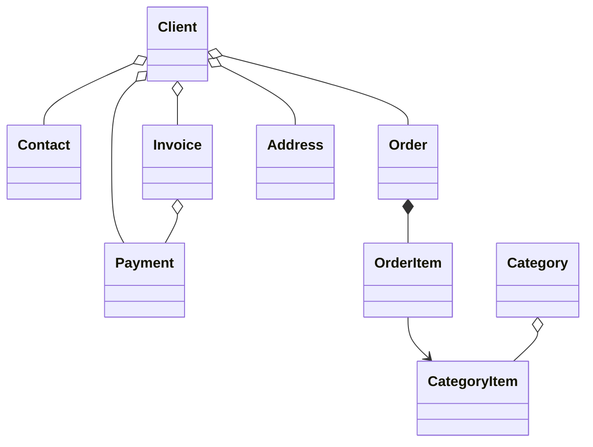

#  B2B CRM

🖥️ [Online Demo](https://demo.jmix.ru/b2b-crm/login)

🌐 Языки: [English](../README.md) | [Русский](README_ru.md) | [Deutsch](README_de.md) | [Italiano](README_it.md) | [Español](README_es.md) | [Tiếng Việt](README_vi.md) | [Srpski](README_sr.md)

`B2B CRM` — корпоративное демонстрационное приложение на базе `Jmix framework` со встроенным `AI`, которое показывает, как разрабатывать готовые к production бизнес-системы для работы с `клиентами`, `заказами`, `счетами`, `финансами` и `аналитикой`.

## 📑 Содержание

- [Технический стек](#-технический-стек)
- [Обзор](#-обзор)
- [AI-ассистент](#-ai-ассистент)
- [Add-ons](#-используемые-add-ons)
- [Сборка и запуск](#-сборка-и-запуск)
- [Демо-данные](#-демо-данные)
- [Учетные записи](#-учетные-записи-приложения)
- [Модель предметной области](#-модель-предметной-области)
- [Ролевая модель](#-ролевая-модель)
- [Подробнее о Jmix](#ℹ-подробнее-о-jmix)
- [FAQ](#-faq)

## 🛠️ Технический стек

- Java 21
- Jmix (Spring Boot & Vaadin Flow)
- Firebird

## 📖 Обзор

<details>
<summary>📸 Скриншоты (нажмите, чтобы развернуть)</summary>

<h3>Страница входа</h3>


<h3>Дашборд</h3>


<h3>CRM AI</h3>


<h3>Клиенты</h3>


<h3>Заказы</h3>


<h3>О приложении</h3>


</details>

### ✨ Основные возможности

Проект моделирует типичный процесс B2B-продаж:

- Управление каталогом продуктов и категорий
- Ведение клиентов, контактов и адресов
- Отслеживание заказов по воронке продаж
- Выставление счетов и регистрация платежей
- Планирование и контроль пользовательских задач
- Запрос бизнес-инсайтов у встроенного AI-ассистента
- Просмотр аналитики продаж на дашборде и во встроенных отчетах

#### 📈 Автоматизация продаж

`B2B CRM` помогает менеджерам по продажам автоматизировать процессы продаж: система ведет учет сделок, счетов, оплат и пользовательских задач и позволяет быстро получать аналитику по клиентам. Например, быстро отвечать на типичные пользовательские запросы:

- Сколько сделок находится на этапе пресейла или на этапе ожидания оплаты, на какую сумму
- Какие клиенты являются лидерами по выручке, а какие аутсайдерами — по каким товарным категориям
- Как часто покупают выбранные клиенты
- Сравнить варианты предложений клиентам между собой и определить, какими были максимальные скидки на определенную товарную категорию

Обычно подобные запросы требуют конфигурирования специализированных отчетов и знаний аналитика. В `B2B CRM` достаточно просто написать запрос на естественном языке: встроенный [AI-ассистент](#-ai-ассистент) помогает анализировать продажи, агрегируя данные по сделкам, счетам и платежам с учетом прав доступа пользователя к данным.

#### 🔽 Воронка продаж

Экран `Заказы` содержит интерактивную воронку продаж на основе статусов заказов: `Новый` → `Принят` → `В процессе` → `Выполнен`. Каждый этап показывает количество заказов на нем, а один клик переводит менеджера к заказам выбранного этапа — с суммами итого, выставленных счетов, оплат и остатка по каждому заказу.

## 🤖 AI-ассистент

Приложение включает встроенное рабочее пространство `CRM AI` для анализа CRM-данных на естественном языке.

#### ✨ Ключевые возможности:

- Задавать бизнес-вопросы о клиентах, заказах, счетах, платежах и эффективности продаж
- Загружать сущности и файлы в контекст диалога
- Учитывать права доступа текущего пользователя к данным и хранить диалоги приватно для их автора
- Использовать встроенные бизнес-отчеты, такие как `Client 360 Report` и `Category Cashflow Risk Allocation Report`
- Сохранять историю диалогов с автоматически сгенерированными названиями чатов
- Генерировать интерактивные ссылки на записи CRM прямо в ответах

#### ⚙️ Настройка:

Укажите `spring.ai.openai.api-key` в [application.properties](../src/main/resources/application.properties)
или передайте переменную окружения `SPRING_AI_OPENAI_APIKEY`.

После включения откройте пункт `CRM AI` в главном меню, чтобы начать новый диалог.

## 🧩 Используемые Add-ons

- [AI Tools](https://www.jmix.ru/marketplace/ai-tools/)
- [Audit](https://www.jmix.ru/marketplace/audit/)
- [Application Settings](https://www.jmix.ru/marketplace/application-settings/)
- [Charts](https://www.jmix.ru/marketplace/charts/)
- [Data tools](https://www.jmix.ru/marketplace/data-tools/)
- [Dynamic attributes](https://www.jmix.ru/marketplace/dynamic-attributes/)
- [Grid export](https://www.jmix.ru/marketplace/grid-export-actions/)
- [Reports](https://www.jmix.ru/marketplace/reports/)
- Local File Storage, Localizations

## 🚀 Сборка и запуск

#### Запуск проекта

1. Запустите Jmix run configuration [B2B CRM](../.run/crm-app.run.xml) или выполните команду

   ```bash
   ./gradlew bootRun
   ```

2. [Откройте URL приложения](http://localhost:8080/b2b-crm)

#### Запуск через JAR:

```bash
./gradlew bootJar -Pvaadin.productionMode
```

```bash
java -jar build/libs/crm.jar
```

#### Запуск через Docker

```bash
docker build -t jmix-crm .
```

```bash
docker run --rm -p 8080:8080 jmix-crm
```

#### Запуск через Docker Compose

```bash
docker-compose up
```

## 🎲 Демо-данные

Локальный профиль генерирует демо-данные при старте приложения:

- Генерацию демо-данных можно отключить свойством `crm.generateDemoData`
  в [application.properties](../src/main/resources/application.properties)
- Каталог импортируется из [catalog.xlsx](../src/main/resources/demo-data/catalog.xlsx)

## 👥 Учетные записи приложения

| Должность       | Имя пользователя | Пароль  | Доступ                                                |
|-----------------|------------------|---------|-------------------------------------------------------|
| Administrator   | `admin`          | admin   | Полный доступ ко всем данным и настройкам             |
| Supervisor      | `james`          | james   | Manager + управление каталогом + назначение аккаунтов |
| Manager         | `manager`        | manager | Полный доступ ко всем клиентам и заказам              |
| Account Manager | `alice`          | alice   | Видит только клиентов, назначенных Alice Brown        |
| Account Manager | `robert`         | robert  | Видит только клиентов, назначенных Robert Taylor      |

## ⚙️ Модель предметной области



## 🔐 Ролевая модель

Приложение использует иерархическую ролевую модель:

| Роль            | Описание                                                                                                                                                                       |
|-----------------|--------------------------------------------------------------------------------------------------------------------------------------------------------------------------------|
| `Administrator` | Полный доступ ко всем функциям, сущностям и настройкам приложения.                                                                                                             |
| `Supervisor`    | Расширяет роль `Manager` дополнительными административными возможностями: управление каталогом продуктов и назначение Account Managers клиентам.                               |
| `Manager`       | Основная роль для операций продаж. Полный доступ к Clients, Contacts, Orders, Invoices и Payments. Доступ только на чтение к каталогу продуктов. Управление собственными Tasks. |
| `UI Minimal`    | Минимальный доступ, позволяющий входить в систему и выполнять базовую навигацию.                                                                                               |

## ℹ️ Подробнее о Jmix

| Источник        | Ссылка                                          |
|-----------------|-------------------------------------------------|
| 🌐 Сайт         | https://www.jmix.ru                             |
| 📚 Документация | https://docs.jmix.ru                            |
| 💬 Форум        | https://forum.jmix.ru                           |
| 💻 GitHub       | https://github.com/jmix-framework/jmix          |
| 🎥 YouTube      | https://www.youtube.com/@jmixframework          |
| 💼 LinkedIn     | https://www.linkedin.com/company/jmix-framework |

## 💬 FAQ

> Что такое Jmix?

Jmix — это full-stack open-source Java-платформа для разработки корпоративного программного обеспечения с локальными и публичными моделями.
Она помогает командам разработки быстрее создавать внутренние бизнес-приложения, сохраняя полный контроль над исходным кодом, архитектурой и развертыванием. Jmix объединяет Java, Spring Boot, корпоративный UI, безопасность, доступ к данным, инструменты визуальной разработки и AI-ассистированную разработку в единой платформе.

**Подробнее:**

| Источник     | Ссылка                                 |
|--------------|----------------------------------------|
| Сайт         | https://www.jmix.ru/                   |
| Документация | https://docs.jmix.ru/                  |
| GitHub       | https://github.com/jmix-framework/jmix |

---

> Почему Jmix хорошо подходит для построения CRM-систем?

CRM-системы стали основой современной корпоративной автоматизации, давно выйдя за рамки простой системы учета записей. Поскольку бизнес-требования в продажах меняются быстро, CRM-системы должны также давать возможность быстро вносить изменения в процессы, модель данных и UX, сохраняя при этом высокие стандарты безопасности и соответствия требованиям.
Jmix предоставляет эти возможности «из коробки», позволяя разработчикам сосредоточиться на бизнес-логике вместо инфраструктуры. Это демо показывает, как готовые к production корпоративные приложения могут быть разработаны с помощью Jmix и AI.

---

> Это реальное приложение или просто демо?

B2B CRM — демонстрационное приложение, созданное, чтобы показать готовую к production архитектуру и практики корпоративной разработки.
Оно включает реальные бизнес-сценарии, современный UI, AI-возможности, безопасность, отчетность и паттерны интеграции, которые можно переиспользовать в ваших собственных корпоративных проектах.
