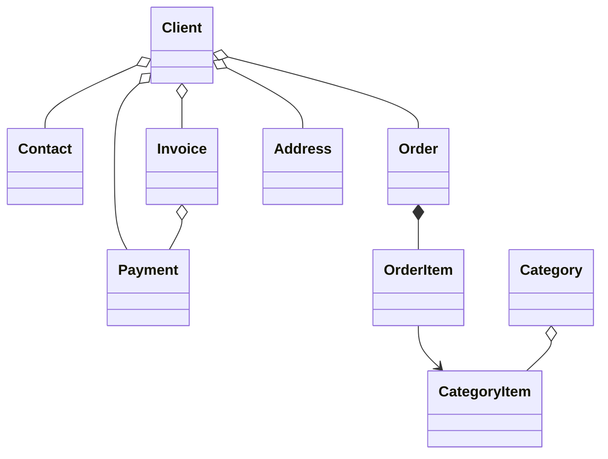

#  B2B CRM

🖥️ [Online Demo](https://demo.jmix.io/b2b-crm/login)

🌐 Jezici: [English](../README.md) | [Русский](README_ru.md) | [Deutsch](README_de.md) | [Italiano](README_it.md) | [Español](README_es.md) | [Tiếng Việt](README_vi.md) | [Srpski](README_sr.md)

`B2B CRM` je poslovna demonstraciona aplikacija zasnovana na `Jmix platformi` sa ugrađenim `AI`, koja prikazuje kako se grade produkcijski spremni poslovni sistemi, uključujući `kupce`, `porudžbine`, `fakturisanje`, `finansije` i `analitiku`.

## 📑 Sadržaj

- [Tehnički stek](#-tehnički-stek)
- [Pregled](#-pregled)
- [AI asistent](#-ai-asistent)
- [Dodaci](#-dodaci)
- [Pokretanje aplikacije](#-pokretanje-i-izvršavanje-aplikacije)
- [Demo podaci](#-demo-podaci)
- [Nalozi](#-korisnički-nalozi-aplikacije)
- [Model domena](#-model-domena)
- [Model uloga](#-model-uloga)
- [Više o Jmix-u](#ℹ-više-o-jmix-u)
- [FAQ](#-faq)

## 🛠️ Tehnički stek

- Java 21
- Jmix (Spring Boot & Vaadin Flow)
- Firebird

## 📖 Pregled

<details>
<summary>📸 Snimci ekrana (kliknite da proširite)</summary>

<h3>Stranica za prijavu</h3>


<h3>Kontrolna tabla</h3>


<h3>CRM AI</h3>


<h3>Klijenti</h3>


<h3>Porudžbine</h3>


<h3>O aplikaciji</h3>


</details>

### ✨ Glavne funkcionalnosti

Ovaj projekat modeluje tipičan B2B prodajni proces:

- Upravljanje katalogom proizvoda i kategorija
- Vođenje klijenata, kontakata i adresa
- Praćenje porudžbina kroz prodajni levak
- Izdavanje faktura i evidentiranje uplata
- Planiranje i kontrola korisničkih zadataka
- Traženje poslovnih uvida od ugrađenog AI asistenta
- Pregled analitike prodaje na kontrolnoj tabli i u ugrađenim izvještajima

#### 📈 Automatizacija prodaje

`B2B CRM` pomaže menadžerima prodaje da automatizuju prodajni proces: sistem vodi evidenciju o prodajnim poslovima, fakturama, uplatama i korisničkim zadacima i omogućava brzu analitiku o klijentima. Na primjer, može brzo odgovoriti na tipična pitanja kao što su:

- Koliko poslova se nalazi u fazi pretprodaje ili čeka na plaćanje i na koji ukupan iznos
- Koji klijenti su lideri po prihodu, a koji zaostaju — i u kojim kategorijama proizvoda
- Koliko često izabrani klijenti kupuju
- Kako se ponude za klijenta međusobno porede i koji su bili maksimalni popusti za određenu kategoriju proizvoda

Obično takvi upiti zahtijevaju konfigurisanje specijalizovanih izvještaja i znanje analitičara. U `B2B CRM` dovoljno je napisati upit prirodnim jezikom: ugrađeni [AI asistent](#-ai-asistent) pomaže u analizi prodaje agregiranjem podataka o poslovima, fakturama i uplatama, uz poštovanje prava pristupa podacima korisnika.

#### 🔽 Prodajni levak

Ekran `Porudžbine` sadrži interaktivni prodajni levak zasnovan na statusima porudžbina: `Nova` → `Prihvaćena` → `U toku` → `Završena`. Svaka faza prikazuje broj porudžbina u njoj, a jedan klik vodi menadžera do porudžbina izabrane faze — sa ukupnim, fakturisanim, plaćenim i preostalim iznosima za svaku porudžbinu.

## 🤖 AI Asistent

Aplikacija uključuje ugrađeni radni prostor `CRM AI` za analizu CRM podataka korišćenjem prirodnog jezika.

#### ✨ Ključne mogućnosti:

- Postavljanje poslovnih pitanja o klijentima, porudžbinama, fakturama, uplatama i rezultatima prodaje
- Otpremanje entiteta i datoteka u kontekst razgovora
- Poštovanje prava pristupa podacima trenutnog korisnika i čuvanje privatnosti razgovora
- Korišćenje ugrađenih poslovnih izvještaja kao što su `Client 360 Report` i `Category Cashflow Risk Allocation Report`
- Čuvanje istorije razgovora sa automatski generisanim naslovima razgovora
- Generisanje interaktivnih linkova ka CRM zapisima direktno u odgovorima

#### ⚙️ Konfiguracija:

Postavite `spring.ai.openai.api-key` u datoteci [application.properties](../src/main/resources/application.properties)
ili obezbijedite promenljivu okruženja `SPRING_AI_OPENAI_APIKEY`.

Kada je funkcionalnost omogućena, otvorite stavku `CRM AI` u glavnom meniju da biste započeli novi razgovor.

## 🧩 Dodaci

- [AI Tools](https://www.jmix.io/marketplace/ai-tools/)
- [Audit](https://www.jmix.io/marketplace/audit/)
- [Application Settings](https://www.jmix.io/marketplace/application-settings/)
- [Charts](https://www.jmix.io/marketplace/charts/)
- [Data tools](https://www.jmix.io/marketplace/data-tools/)
- [Dynamic attributes](https://www.jmix.io/marketplace/dynamic-attributes/)
- [Grid export](https://www.jmix.io/marketplace/grid-export-actions/)
- [Reports](https://www.jmix.io/marketplace/reports/)
- Local File Storage, Localizations

## 🚀 Pokretanje i izvršavanje aplikacije

#### Pokretanje projekta

1. Pokrenite Jmix konfiguraciju za pokretanje [B2B CRM](../.run/crm-app.run.xml) ili izvršite

   ```bash
   ./gradlew bootRun
   ```

2. [Otvorite URL aplikacije](http://localhost:8080/b2b-crm)

#### Pokretanje putem JAR datoteke:

```bash
./gradlew bootJar -Pvaadin.productionMode
```

```bash
java -jar build/libs/crm.jar
```

#### Pokretanje putem Docker-a

```bash
docker build -t jmix-crm .
```

```bash
docker run --rm -p 8080:8080 jmix-crm
```

#### Pokretanje putem Docker Compose-a

```bash
docker-compose up
```

## 🎲 Demo podaci

Lokalni profil generiše demo podatke prilikom pokretanja aplikacije:

- Generisanje demo podataka možete onemogućiti pomoću svojstva `crm.generateDemoData`
  u [datoteci application.properties](../src/main/resources/application.properties)
- Katalog se uvozi iz datoteke [catalog.xlsx](../src/main/resources/demo-data/catalog.xlsx)

## 👥 Korisnički nalozi aplikacije

| Pozicija        | Korisničko ime | Lozinka | Pristup                                           |
|-----------------|----------------|---------|---------------------------------------------------|
| Administrator   | `admin`        | admin   | Potpun pristup svim podacima i podešavanjima      |
| Supervisor      | `james`        | james   | Menadžer + upravljanje katalogom + dodjela naloga |
| Manager         | `manager`      | manager | Potpun pristup svim klijentima i porudžbinama     |
| Account Manager | `alice`        | alice   | Vidi samo klijente dodijeljene Alice Brown        |
| Account Manager | `robert`       | robert  | Vidi samo klijente dodijeljene Robert Taylor      |

## ⚙️ Model domena



## 🔐 Model uloga

Aplikacija koristi hijerarhijski model uloga:

| Uloga           | Opis                                                                                                                                                                     |
|-----------------|--------------------------------------------------------------------------------------------------------------------------------------------------------------------------|
| `Administrator` | Potpun pristup svim funkcionalnostima aplikacije, entitetima i podešavanjima.                                                                                            |
| `Supervisor`    | Proširuje ulogu `Manager` dodatnim administrativnim mogućnostima: upravljanje katalogom proizvoda i dodjeljivanje account menadžera klijentima.                           |
| `Manager`       | Osnovna uloga za prodajne aktivnosti. Potpun pristup klijentima, kontaktima, porudžbinama, fakturama i uplatama. Pristup katalogu proizvoda samo za čitanje. Upravljanje sopstvenim zadacima. |
| `UI Minimal`    | Minimalan pristup koji omogućava prijavu u sistem i osnovnu navigaciju.                                                                                                  |

## ℹ️ Više o Jmix-u

| Izvor           | Link                                            |
|-----------------|-------------------------------------------------|
| 🌐 Veb sajt     | https://www.jmix.io                             |
| 📚 Dokumentacija | https://docs.jmix.io                           |
| 💬 Forum        | https://forum.jmix.io                           |
| 💻 GitHub       | https://github.com/jmix-framework/jmix          |
| 🎥 YouTube      | https://www.youtube.com/@jmixframework          |
| 💼 LinkedIn     | https://www.linkedin.com/company/jmix-framework |

## 💬 FAQ

> Šta je Jmix?

Jmix je full-stack open-source Java platforma za razvoj poslovnog softvera sa lokalnim i javnim modelima.
Pomaže razvojnim timovima da brže grade interne poslovne aplikacije uz potpunu kontrolu nad izvornim kodom, arhitekturom i isporukom. Jmix objedinjuje Java, Spring Boot, poslovni korisnički interfejs, bezbjednost, pristup podacima, alate za vizuelni razvoj i razvoj uz podršku AI u jednoj platformi.

**Saznajte više:**

| Izvor        | Link                                   |
|--------------|----------------------------------------|
| Sajt         | https://www.jmix.io/                   |
| Dokumentacija | https://docs.jmix.io/                 |
| GitHub       | https://github.com/jmix-framework/jmix |

---

> Zašto je Jmix dobar za izgradnju CRM sistema?

CRM sistemi su postali osnova moderne poslovne automatizacije i daleko su prevazišli običnu evidenciju podataka. Kako se poslovni zahtjevi u prodaji brzo mijenjaju, CRM sistemi moraju omogućiti i brze izmjene procesa, modela podataka i korisničkog iskustva, uz očuvanje visokih standarda bezbjednosti i usklađenosti.
Jmix pruža te mogućnosti odmah po instalaciji, što razvojnim timovima omogućava da se fokusiraju na poslovnu logiku umjesto na infrastrukturu. Ova demonstracija pokazuje kako se produkcijski spremne poslovne aplikacije mogu razvijati pomoću Jmix-a i AI.

---

> Da li je ovo prava aplikacija ili samo demonstracija?

B2B CRM je demonstraciona aplikacija napravljena da prikaže produkcijski spremnu arhitekturu i prakse razvoja poslovnog softvera.
Uključuje stvarne poslovne scenarije, moderan korisnički interfejs, AI mogućnosti, bezbjednost, izvještavanje i integracione šablone koji se mogu ponovo koristiti u vašim poslovnim projektima.
