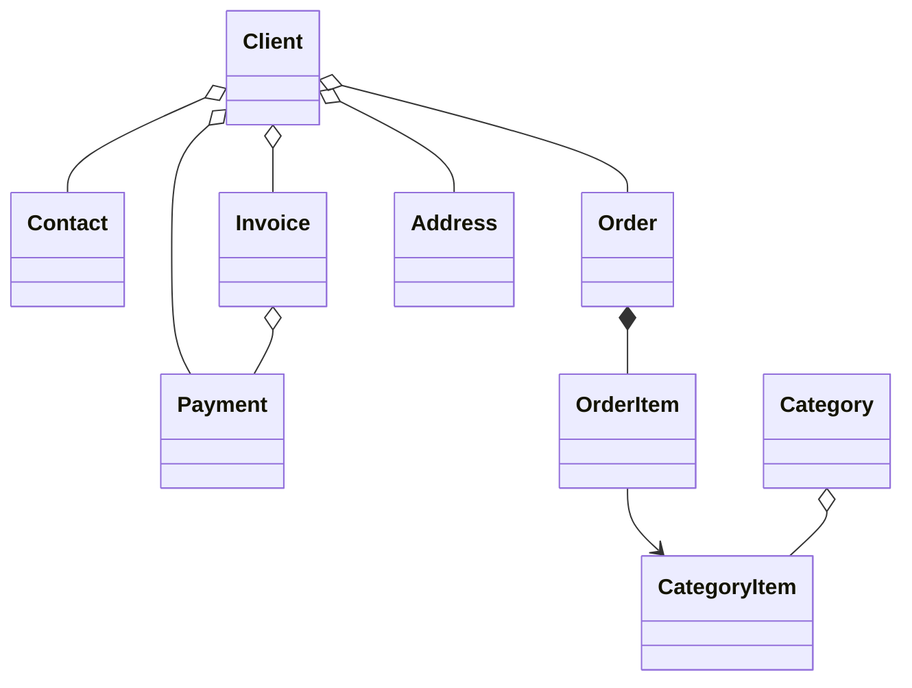

#  B2B CRM

🖥️ [Online Demo](https://demo.jmix.io/b2b-crm/login)

🌐 Ngôn ngữ: [English](../README.md) | [Русский](README_ru.md) | [Deutsch](README_de.md) | [Italiano](README_it.md) | [Español](README_es.md) | [Tiếng Việt](README_vi.md) | [Srpski](README_sr.md)

`B2B CRM` là ứng dụng doanh nghiệp mẫu dựa trên `nền tảng Jmix` với `AI` tích hợp, minh họa cách phát triển các hệ thống kinh doanh sẵn sàng cho môi trường sản xuất, bao gồm `khách hàng`, `đơn hàng`, `hóa đơn`, `tài chính` và `phân tích dữ liệu`.

## 📑 Mục lục

- [Ngăn xếp công nghệ](#-ngăn-xếp-công-nghệ)
- [Tổng quan](#-tổng-quan)
- [Trợ lý AI](#-trợ-lý-ai)
- [Các add-on](#-các-add-on-được-sử-dụng)
- [Xây dựng và chạy ứng dụng](#-xây-dựng-và-chạy-ứng-dụng)
- [Dữ liệu mẫu](#-dữ-liệu-mẫu)
- [Tài khoản ứng dụng](#-tài-khoản-ứng-dụng)
- [Mô hình miền](#-mô-hình-miền)
- [Mô hình vai trò](#-mô-hình-vai-trò)
- [Tìm hiểu thêm về Jmix](#ℹ-tìm-hiểu-thêm-về-jmix)
- [FAQ](#-faq)

## 🛠️ Ngăn xếp công nghệ

- Java 21
- Jmix (Spring Boot & Vaadin Flow)
- Firebird

## 📖 Tổng quan

<details>
<summary>📸 Ảnh chụp màn hình (nhấn để mở rộng)</summary>

<h3>Trang đăng nhập</h3>


<h3>Bảng điều khiển</h3>


<h3>CRM AI</h3>


<h3>Khách hàng</h3>


<h3>Đơn hàng</h3>


<h3>Giới thiệu</h3>


</details>

### ✨ Tính năng chính

Dự án này mô phỏng quy trình bán hàng B2B điển hình:

- Quản lý danh mục sản phẩm và nhóm sản phẩm
- Quản lý khách hàng, người liên hệ và địa chỉ
- Theo dõi đơn hàng theo phễu bán hàng
- Phát hành hóa đơn và ghi nhận thanh toán
- Lập kế hoạch và theo dõi công việc của người dùng
- Hỏi trợ lý AI tích hợp để có thông tin phân tích kinh doanh
- Xem phân tích doanh số trên bảng điều khiển và trong các báo cáo tích hợp

#### 📈 Tự động hóa bán hàng

`B2B CRM` giúp nhân viên bán hàng tự động hóa quy trình bán hàng: hệ thống theo dõi các thương vụ, hóa đơn, thanh toán và công việc của người dùng, đồng thời cung cấp phân tích nhanh về khách hàng. Ví dụ, hệ thống có thể nhanh chóng trả lời những câu hỏi thường gặp như:

- Có bao nhiêu thương vụ đang ở giai đoạn tiền bán hàng hoặc đang chờ thanh toán, và với tổng giá trị bao nhiêu
- Những khách hàng nào dẫn đầu về doanh thu và những khách hàng nào tụt lại phía sau — và ở những nhóm sản phẩm nào
- Các khách hàng được chọn mua hàng thường xuyên như thế nào
- Các đề xuất cho một khách hàng so sánh với nhau ra sao, và mức giảm giá tối đa cho một nhóm sản phẩm cụ thể là bao nhiêu

Thông thường, những yêu cầu như vậy đòi hỏi phải cấu hình các báo cáo chuyên biệt và cần đến chuyên môn của nhà phân tích. Trong `B2B CRM`, chỉ cần viết yêu cầu bằng ngôn ngữ tự nhiên: [Trợ lý AI](#-trợ-lý-ai) tích hợp giúp phân tích doanh số bằng cách tổng hợp dữ liệu về thương vụ, hóa đơn và thanh toán, đồng thời tôn trọng quyền truy cập dữ liệu của người dùng.

#### 🔽 Phễu bán hàng

Màn hình `Đơn hàng` có phễu bán hàng tương tác dựa trên trạng thái đơn hàng: `Mới` → `Đã chấp nhận` → `Đang thực hiện` → `Hoàn tất`. Mỗi giai đoạn hiển thị số lượng đơn hàng ở giai đoạn đó, và chỉ một cú nhấp chuột sẽ đưa nhân viên bán hàng đến các đơn hàng của giai đoạn được chọn — cùng với tổng số tiền, số tiền đã xuất hóa đơn, đã thanh toán và còn lại của từng đơn hàng.

## 🤖 Trợ lý AI

Ứng dụng bao gồm không gian làm việc `CRM AI` được tích hợp sẵn để phân tích dữ liệu CRM bằng ngôn ngữ tự nhiên.

#### ✨ Các khả năng chính:

- Đặt câu hỏi kinh doanh về khách hàng, đơn hàng, hóa đơn, thanh toán và hiệu suất bán hàng
- Tải các thực thể và tệp lên ngữ cảnh cuộc trò chuyện
- Tôn trọng quyền truy cập dữ liệu của người dùng hiện tại và giữ riêng tư các cuộc trò chuyện
- Sử dụng các báo cáo nghiệp vụ tích hợp như `Client 360 Report` và `Category Cashflow Risk Allocation Report`
- Lưu lịch sử hội thoại với tiêu đề được tạo tự động
- Tạo liên kết tương tác đến các bản ghi CRM trực tiếp trong câu trả lời

#### ⚙️ Cấu hình:

Thiết lập `spring.ai.openai.api-key` trong [application.properties](../src/main/resources/application.properties)
hoặc cung cấp biến môi trường `SPRING_AI_OPENAI_APIKEY`.

Sau khi được kích hoạt, hãy mở mục `CRM AI` trong menu chính để bắt đầu một cuộc trò chuyện mới.

## 🧩 Các add-on được sử dụng

- [AI Tools](https://www.jmix.io/marketplace/ai-tools/)
- [Audit](https://www.jmix.io/marketplace/audit/)
- [Application Settings](https://www.jmix.io/marketplace/application-settings/)
- [Charts](https://www.jmix.io/marketplace/charts/)
- [Data tools](https://www.jmix.io/marketplace/data-tools/)
- [Dynamic attributes](https://www.jmix.io/marketplace/dynamic-attributes/)
- [Grid export](https://www.jmix.io/marketplace/grid-export-actions/)
- [Reports](https://www.jmix.io/marketplace/reports/)
- Local File Storage, Localizations

## 🚀 Xây dựng và chạy ứng dụng

#### Chạy dự án

1. Chạy cấu hình Jmix cho [B2B CRM](../.run/crm-app.run.xml) hoặc thực thi

   ```bash
   ./gradlew bootRun
   ```

2. [Mở URL của ứng dụng](http://localhost:8080/b2b-crm)

#### Chạy bằng JAR:

```bash
./gradlew bootJar -Pvaadin.productionMode
```

```bash
java -jar build/libs/crm.jar
```

#### Chạy bằng Docker

```bash
docker build -t jmix-crm .
```

```bash
docker run --rm -p 8080:8080 jmix-crm
```

#### Chạy bằng Docker Compose

```bash
docker-compose up
```

## 🎲 Dữ liệu mẫu

Hồ sơ cục bộ sẽ tạo dữ liệu mẫu khi ứng dụng khởi động:

- Bạn có thể tắt việc tạo dữ liệu mẫu bằng thuộc tính `crm.generateDemoData`
  trong [application.properties](../src/main/resources/application.properties)
- Danh mục sản phẩm được nhập từ [catalog.xlsx](../src/main/resources/demo-data/catalog.xlsx)

## 👥 Tài khoản ứng dụng

| Vai trò         | Tên đăng nhập | Mật khẩu | Quyền truy cập                                   |
|-----------------|---------------|----------|--------------------------------------------------|
| Administrator   | `admin`       | admin    | Toàn quyền truy cập dữ liệu và cấu hình          |
| Supervisor      | `james`       | james    | Manager + quản lý danh mục + phân công tài khoản |
| Manager         | `manager`     | manager  | Toàn quyền truy cập khách hàng và đơn hàng       |
| Account Manager | `alice`       | alice    | Chỉ xem khách hàng được gán cho Alice Brown      |
| Account Manager | `robert`      | robert   | Chỉ xem khách hàng được gán cho Robert Taylor    |

## ⚙️ Mô hình miền



## 🔐 Mô hình vai trò

Ứng dụng sử dụng mô hình vai trò phân cấp:

| Vai trò         | Mô tả                                                                                                                                                                         |
|-----------------|-------------------------------------------------------------------------------------------------------------------------------------------------------------------------------|
| `Administrator` | Toàn quyền truy cập tất cả tính năng, thực thể và cấu hình của ứng dụng.                                                                                                       |
| `Supervisor`    | Mở rộng vai trò `Manager` với các khả năng quản trị bổ sung: quản lý danh mục sản phẩm và gán Account Manager cho khách hàng.                                                  |
| `Manager`       | Vai trò chính cho hoạt động bán hàng. Toàn quyền truy cập Clients, Contacts, Orders, Invoices và Payments. Chỉ có quyền xem danh mục sản phẩm. Quản lý các Task của chính mình. |
| `UI Minimal`    | Quyền tối thiểu, cho phép đăng nhập và điều hướng cơ bản.                                                                                                                      |

## ℹ️ Tìm hiểu thêm về Jmix

| Nguồn         | Liên kết                                        |
|---------------|-------------------------------------------------|
| 🌐 Trang web  | https://www.jmix.io                             |
| 📚 Tài liệu   | https://docs.jmix.io                            |
| 💬 Diễn đàn   | https://forum.jmix.io                           |
| 💻 GitHub     | https://github.com/jmix-framework/jmix          |
| 🎥 YouTube    | https://www.youtube.com/@jmixframework          |
| 💼 LinkedIn   | https://www.linkedin.com/company/jmix-framework |

## 💬 FAQ

> Jmix là gì?

Jmix là nền tảng Java full-stack mã nguồn mở dành cho phát triển phần mềm doanh nghiệp với các mô hình cục bộ và công khai.
Nền tảng này giúp các nhóm phát triển xây dựng ứng dụng nghiệp vụ nội bộ nhanh hơn trong khi vẫn giữ toàn quyền kiểm soát mã nguồn, kiến trúc và triển khai. Jmix kết hợp Java, Spring Boot, giao diện doanh nghiệp, bảo mật, truy cập dữ liệu, công cụ phát triển trực quan và phát triển có sự hỗ trợ của AI trong một nền tảng duy nhất.

**Tìm hiểu thêm:**

| Nguồn     | Liên kết                               |
|-----------|----------------------------------------|
| Trang web | https://www.jmix.io/                   |
| Tài liệu  | https://docs.jmix.io/                  |
| GitHub    | https://github.com/jmix-framework/jmix |

---

> Vì sao Jmix phù hợp để xây dựng hệ thống CRM?

Hệ thống CRM đã trở thành nền tảng của tự động hóa doanh nghiệp hiện đại, vượt xa một hệ thống lưu trữ bản ghi đơn thuần. Do yêu cầu nghiệp vụ trong bán hàng thay đổi nhanh chóng, hệ thống CRM cũng phải cho phép thay đổi nhanh quy trình, mô hình dữ liệu và UX trong khi vẫn duy trì tiêu chuẩn cao về bảo mật và tuân thủ.
Jmix cung cấp sẵn các khả năng này, giúp nhà phát triển tập trung vào logic nghiệp vụ thay vì hạ tầng. Bản demo này cho thấy cách xây dựng ứng dụng doanh nghiệp sẵn sàng cho môi trường sản xuất bằng Jmix và AI.

---

> Đây là ứng dụng thật hay chỉ là bản demo?

B2B CRM là ứng dụng demo được thiết kế để minh họa kiến trúc sẵn sàng cho môi trường sản xuất và các thực tiễn phát triển doanh nghiệp.
Ứng dụng bao gồm các tình huống nghiệp vụ thực tế, giao diện hiện đại, khả năng AI, bảo mật, báo cáo và các mẫu tích hợp có thể tái sử dụng trong các dự án doanh nghiệp của bạn.
